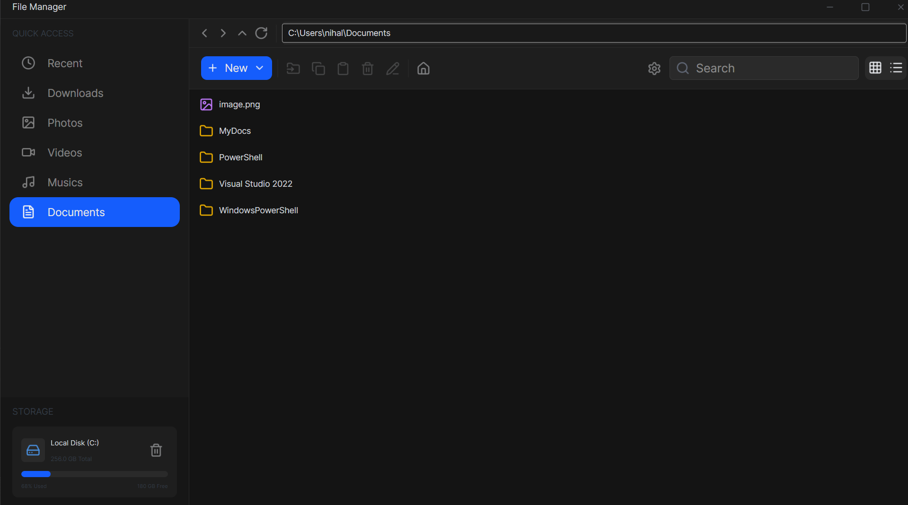

# FileManager

Am trying to make a fast FileManager using `C#` and [`fd`](https://github.com/sharkdp/fd) i have made a protype in Console using `C#` and added some features now am working on UI
of it

## LATEST UI

## NEW ->
- Overhall in buttons
- added side panel functionallity
- added open a app according to a keybind you set which binds to an file type 
- smooth UI animation
- added icons

## Features - APP ([`AVALONIA`](https://avaloniaui.net/))
- Can move back using backspace
- Can search and incridible speed thanks to [**fd**](https://github.com/sharkdp/fd)
- Create File/Folder
- Copy File/Folder
- Move File/Folder
- Enter path to go to that entry
- Rename File/Folder
- FileSelection (for now no multiselect)
- Refresh
- Recent section
- Home button
- Open a app according to a keybind you set which binds to an file type 

## Tools Used

- Application Framework : - [**Avalonia**](https://avaloniaui.net/)
- Search Engine :- [**fd**](https://github.com/sharkdp/fd)

## More

more features will be added in future
this read me may contain a lot of of mispell bare with it :D

btw if you wana know about this you can read the code i have added comment for you understanding (good luck :D)
